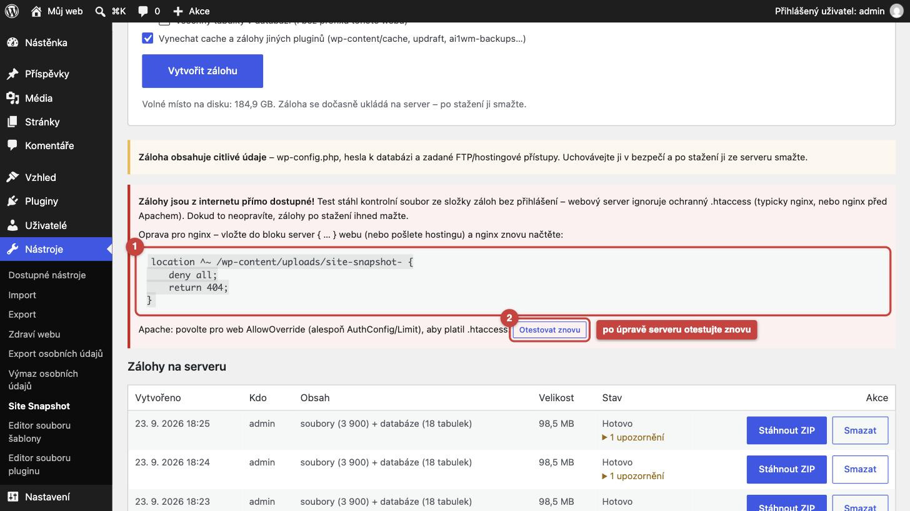
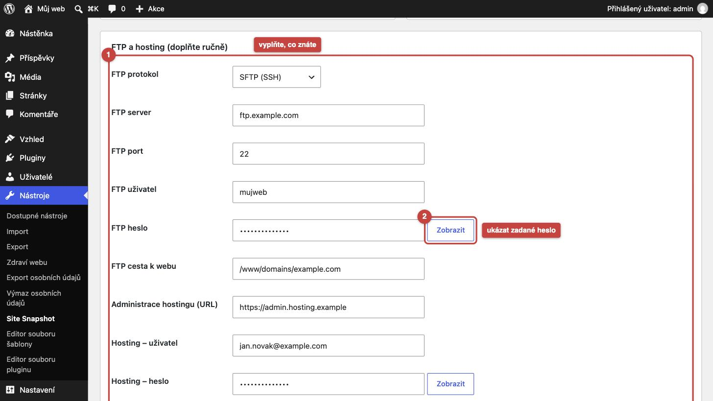
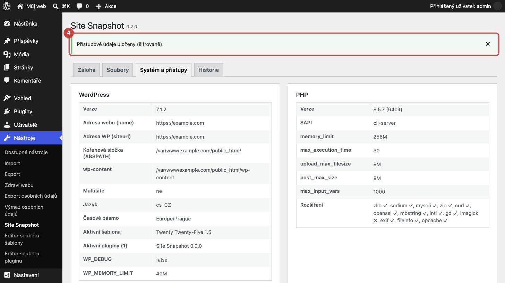
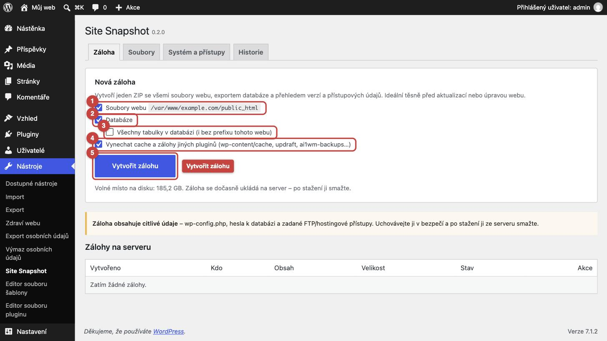
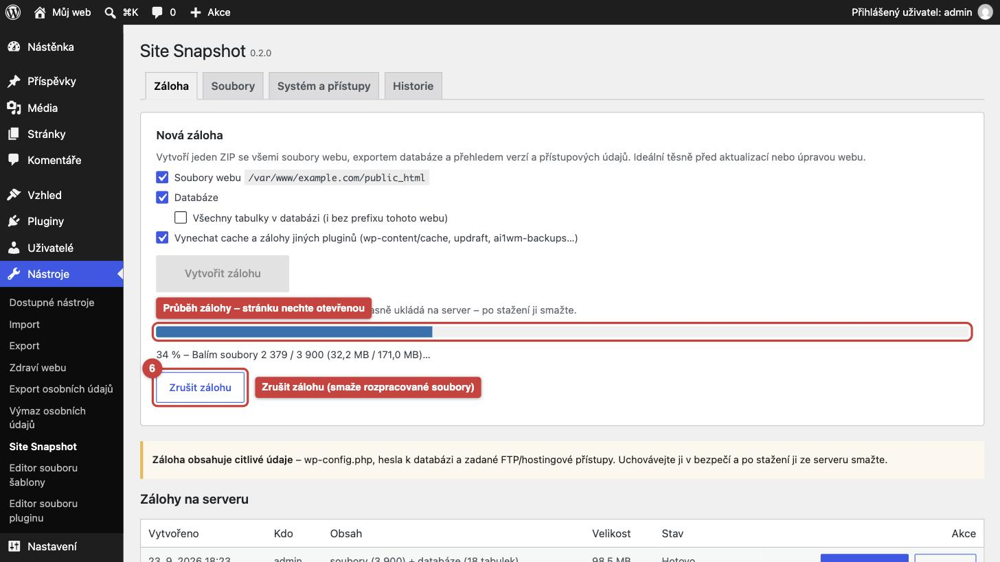
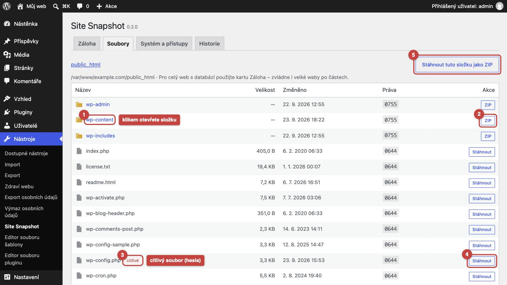
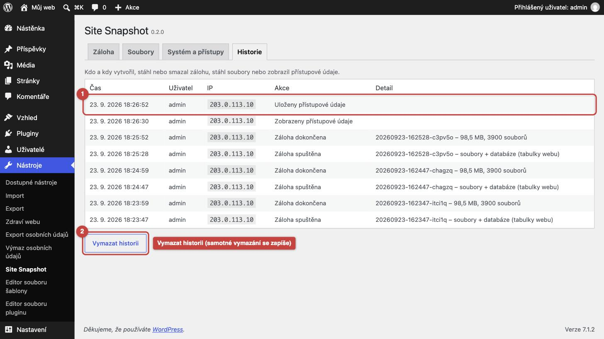

# Site Snapshot – kompletní návod

Návod provede instalací, zabezpečením, první zálohou, stažením a **obnovou webu ze zálohy**. Na konci je řešení
častých problémů a nastavení pro velké weby.

> Chcete jen rychle vidět, kam kliknout? → **[Ovládání krok za krokem](OVLADANI.md)** (obrázkový průvodce).

**Obsah**

1. [K čemu plugin je](#1-k-čemu-plugin-je)
2. [Požadavky](#2-požadavky)
3. [Instalace](#3-instalace)
4. [Zabezpečení úložiště záloh (důležité)](#4-zabezpečení-úložiště-záloh-důležité)
5. [Doplnění FTP a hostingových přístupů](#5-doplnění-ftp-a-hostingových-přístupů)
6. [Vytvoření zálohy](#6-vytvoření-zálohy)
7. [Stažení zálohy a co je uvnitř](#7-stažení-zálohy-a-co-je-uvnitř)
8. [Prohlížeč souborů](#8-prohlížeč-souborů)
9. [Historie (audit log)](#9-historie-audit-log)
10. [Obnova webu ze zálohy](#10-obnova-webu-ze-zálohy)
11. [Velké weby a limity hostingu](#11-velké-weby-a-limity-hostingu)
12. [Řešení problémů](#12-řešení-problémů)
13. [Odinstalace](#13-odinstalace)
14. [Pro vývojáře](#14-pro-vývojáře)

---

## 1. K čemu plugin je

Před aktualizací WordPressu, šablony nebo pluginů (nebo před jakýmkoli zásahem do webu) chcete mít **jednu
kompletní zálohu**, ze které web vrátíte do původního stavu. Site Snapshot ji vytvoří jedním tlačítkem přímo
v administraci – bez FTP klienta, phpMyAdminu a bez přístupu na server.

Jeden ZIP obsahuje:

- všechny soubory webu (WordPress, šablony, pluginy, nahraná média, `wp-config.php`),
- export databáze (`database.sql`),
- `SITE-INFO.txt` – verze PHP, databáze, WordPressu, serveru, přístupy k databázi, FTP/hosting údaje a seznam
  administrátorů v okamžiku zálohy,
- `OBNOVA-README.txt` – postup obnovy pro konkrétní web.

> Plugin **nenahrazuje pravidelné zálohy** hostingu nebo zálohovací službu – je to rychlý „snapshot“ před
> úpravami. Záloha leží na stejném serveru jako web, dokud ji nestáhnete.

---

## 2. Požadavky

| Co | Minimum | Kde zjistit |
| --- | --- | --- |
| WordPress | 5.6 | Nástěnka → Aktualizace |
| PHP | 7.4, **64bitové** | po instalaci karta *Systém a přístupy* |
| Databáze | MySQL 5.7+ / MariaDB 10.3+ | tamtéž |
| PHP rozšíření | `zlib` (komprese), `sodium` (šifrování – je v PHP 7.2+, jinak ho doplní WordPress) | tamtéž, řádek *Rozšíření* |
| Volné místo na disku | zhruba **tolik, kolik zabírá web** (+ databáze) | karta *Záloha*, pod tlačítkem |
| Oprávnění | účet s rolí **Administrátor** (na multisite **super admin**) | |

Nepotřebujete `exec()`, `mysqldump`, SSH ani rozšíření `ZipArchive` – vše běží v čistém PHP, takže plugin
funguje i na levném sdíleném hostingu.

---

## 3. Instalace

### A) Přes administraci (doporučeno)

1. Stáhněte z [Releases](https://github.com/JirakJ/site-snapshot/releases/latest) soubor **`site-snapshot-X.Y.Z.zip`** (ne „Source code“).
2. V administraci otevřete **Pluginy → Přidat plugin → Nahrát plugin**.
3. Vyberte stažený ZIP, klikněte **Instalovat** a pak **Aktivovat**.
4. Plugin najdete v menu **Nástroje → Site Snapshot**.

> Pokud nahrání selže (hosting zakazuje instalaci pluginů z administrace, nebo je `upload_max_filesize` menší než
> ZIP pluginu – ten má cca 50 kB), použijte variantu B.

### B) Přes FTP

1. Stažený ZIP rozbalte – vznikne složka `site-snapshot`.
2. FTP klientem (FileZilla, Cyberduck, WinSCP…) ji nahrajte do `wp-content/plugins/`, výsledkem je
   `wp-content/plugins/site-snapshot/site-snapshot.php`.
3. V administraci **Pluginy** → u „Site Snapshot“ klikněte **Aktivovat**.

### C) Přes WP-CLI

```sh
wp plugin install https://github.com/JirakJ/site-snapshot/releases/download/v0.2.1/site-snapshot-0.2.1.zip --activate
```

(Číslo verze na obou místech upravte podle [posledního releasu](https://github.com/JirakJ/site-snapshot/releases/latest).)

### Aktualizace pluginu

Nahrajte nový ZIP stejným postupem – WordPress nabídne **Nahradit aktuální verzí nahranou**. Stávající zálohy,
uložené přístupy i historie zůstanou zachované.

---

## 4. Zabezpečení úložiště záloh (důležité)

Záloha obsahuje hesla (`wp-config.php`, `SITE-INFO.txt`). Plugin ji ukládá do
`wp-content/uploads/site-snapshot-<24 náhodných znaků>/` a stahuje se **jen přes administraci** (přihlášený
administrátor + bezpečnostní token). Kdyby ale někdo znal přesnou adresu souboru, musí ho zastavit webový server.
Plugin do složky zapisuje ochranné soubory:

| Server | Ochrana | Stav |
| --- | --- | --- |
| **Apache**, **LiteSpeed** / OpenLiteSpeed | `.htaccess` (`Require all denied`) | na Apache 2.4 ověřeno – 403; funguje jen s povoleným `AllowOverride` |
| **IIS** | `web.config` (URL Authorization, `Deny *`) | neověřeno – spoléhejte na samotest níže |
| **nginx** (i nginx před Apachem, OpenResty…) | nginx `.htaccess` nečte | **nutné doplnit pravidlo** |

### Samotest ochrany

Při otevření karty *Záloha* si plugin zkusí stáhnout kontrolní soubor ze složky záloh **stejně jako návštěvník
bez přihlášení**. Nezáleží tedy na typu serveru ani na tom, jestli před webem stojí nginx nebo CDN:

- **nic se nezobrazí** → ochrana funguje (výsledek se pamatuje 24 hodin),
- **červené upozornění** → zálohy jsou z internetu dostupné; obsahuje pravidlo pro nginx vygenerované pro váš web,
- **modrá informace** → web nedokáže volat sám sebe (blokovaný loopback), ověřte ochranu ručně (níže).

Tlačítko **Otestovat znovu** test zopakuje hned (např. po úpravě konfigurace serveru).



### nginx

Pravidlo (pro běžný web, kde jsou nahrané soubory v `/wp-content/uploads`):

```nginx
location ^~ /wp-content/uploads/site-snapshot- {
    deny all;
    return 404;
}
```

1. Vložte ho do bloku `server { … }` vašeho webu (typicky `/etc/nginx/sites-available/<web>.conf`).
   Díky `^~` nezáleží na pořadí – má přednost i před bloky typu `location ~* \.(zip|txt)$`.
2. Ověřte konfiguraci a načtěte ji: `sudo nginx -t && sudo systemctl reload nginx`.
3. Na spravovaném hostingu (bez přístupu ke konfiguraci) pošlete pravidlo podpoře hostingu.

Na **multisite** (podweby mají vlastní složky záloh a v podadresářové síti i více adres) plugin vygeneruje
pravidlo podle jedinečného názvu složky:

```nginx
location ~ "/site-snapshot-[a-z0-9]{16,}(/|$)" {
    deny all;
    return 404;
}
```

Vložte ho **před** ostatní bloky `location ~` (regexy nginx vyhodnocuje v pořadí, v jakém jsou zapsané). Uvozovky
jsou nutné – bez nich nginx konfiguraci odmítne kvůli `{`. Ověřeno i s přepisovacími pravidly multisite
(`/shop/wp-content/…` → `/wp-content/…`).

### Ruční ověření

Přes FTP se podívejte do `wp-content/uploads/` a zjistěte přesný název složky `site-snapshot-…`. Pak:

```sh
curl -I https://vas-web.cz/wp-content/uploads/site-snapshot-XXXXXXXXXXXXXXXXXXXXXXXX/probe.txt
```

Správně je **403** nebo **404**. Pokud vidíte **200**, ochrana nefunguje – nenechávejte zálohy na serveru.

> Nezávisle na serveru: **po stažení zálohu ze serveru smažte** (tlačítko *Smazat*).

---

## 5. Doplnění FTP a hostingových přístupů

WordPress zná jen přístupy k databázi (z `wp-config.php`). FTP a hosting doplňte ručně, ať jsou v každé záloze
pohromadě:

1. **Nástroje → Site Snapshot → Systém a přístupy**, sjeďte k části **FTP a hosting (doplňte ručně)**.
2. Vyplňte, co znáte – protokol (FTP / FTPS / SFTP), server, port, uživatele, heslo, cestu k webu, adresu
   administrace hostingu, přihlášení k hostingu, odkaz na phpMyAdmin/Adminer a volnou poznámku.
3. Klikněte **Uložit přístupy**.



- Hodnoty se ukládají **šifrovaně** (libsodium, klíč odvozený z bezpečnostních klíčů ve `wp-config.php`) – únik
  samotné databáze je neprozradí.
- Heslo k databázi je na stránce skryté, tlačítkem **Zobrazit** ho odkryjete, **Kopírovat** ho zkopíruje.
- Zobrazení stránky se zapíše do historie (nejvýš jednou za 10 minut na uživatele).
- Pokud se změní bezpečnostní klíče (`AUTH_KEY`, `AUTH_SALT`) ve `wp-config.php`, uložené údaje už nejde
  dešifrovat – plugin na to upozorní a stačí je zadat znovu.

Horní část stránky ukazuje verze a limity – hodí se při komunikaci s podporou hostingu:



---

## 6. Vytvoření zálohy

1. **Nástroje → Site Snapshot**, karta **Záloha**.
2. Zvolte obsah:
   - **Soubory webu** – celý kořen WordPressu (cesta je uvedená vedle),
   - **Databáze** – tabulky tohoto webu (podle prefixu, např. `wp_`),
     - *Všechny tabulky v databázi* – i tabulky bez prefixu (jiné aplikace ve stejné DB),
   - **Vynechat cache a zálohy jiných pluginů** – `wp-content/cache`, `upgrade`, UpdraftPlus, All-in-One WP
     Migration, Duplicator, WPvivid, BackWPup, LiteSpeed a Divi cache. Doporučeno nechat zapnuté.
3. Klikněte **Vytvořit zálohu**.



Záloha běží po krátkých krocích a ukazuje průběh:



- **Nechte stránku otevřenou**, dokud záloha neskončí. Při pokusu o odchod se prohlížeč zeptá.
- Když stránku zavřete nebo spadne připojení, záloha se **pozastaví a nic se neztratí**:
  - do 15 minut se po otevření karty *Záloha* rozběhne sama,
  - později je v seznamu jako **Přerušeno** s tlačítkem **Pokračovat** (pokračuje od posledního uloženého místa),
  - přerušená záloha, na kterou se 24 hodin nesáhne, se automaticky smaže.
- **Zrušit zálohu** ji zastaví a smaže rozpracované soubory.
- Najednou může běžet jen jedna záloha.

Po dokončení se stránka obnoví a záloha se objeví v seznamu **Zálohy na serveru**. Pokud se některé soubory
nepodařilo přečíst (práva), je u zálohy odkaz **N upozornění** se seznamem – zbytek zálohy je v pořádku.

---

## 7. Stažení zálohy a co je uvnitř

V seznamu klikněte **Stáhnout ZIP**. Soubor se jmenuje `vas-web.cz-RRRR-MM-DD-HHMMSS.zip`.

```
vas-web.cz-2026-09-23-141456.zip
├── files/                 kořen WordPressu (wp-admin, wp-content, wp-includes, wp-config.php, .htaccess…)
├── extra/                 jen pokud část instalace leží mimo kořen (viz níže)
├── database.sql           export databáze
├── SITE-INFO.txt          verze + přístupové údaje v době zálohy (čitelné)
├── site-info.json         totéž strojově čitelné
└── OBNOVA-README.txt      postup obnovy pro tento web
```

**`extra/`** vznikne, když je `wp-config.php` o úroveň výš než WordPress (běžné zabezpečení) nebo když jsou
`wp-content` / pluginy / uploads přesunuté mimo kořen (např. Bedrock). `OBNOVA-README.txt` u každé položky
uvádí její původní cestu.

**Po stažení:**

1. Ověřte, že se ZIP otevře (poklepáním / „Rozbalit vše“).
2. Uložte ho na bezpečné místo (šifrovaný disk, správce hesel s přílohami…) – obsahuje hesla.
3. Ze serveru zálohu **smažte** tlačítkem **Smazat**.

Nedokončené, zrušené a neúspěšné zálohy plugin sám maže po 24 hodinách. Hotové zálohy nechává, dokud je nesmažete.

---

## 8. Prohlížeč souborů

Karta **Soubory** funguje jako jednoduchý FTP klient jen pro čtení:



- klikáním procházíte složky, nahoře je drobečková navigace,
- u souboru **Stáhnout**, u složky **ZIP** (stáhne složku včetně podsložek),
- **Stáhnout tuto složku jako ZIP** vpravo nahoře stáhne aktuální složku,
- soubory s konfigurací a hesly (`wp-config.php`, `.htaccess`, `.env`, `.user.ini`…) mají štítek **citlivé**,
- nečitelné soubory jsou zašedlé.

Prohlížeč nepustí mimo kořen WordPressu a nezobrazí úložiště záloh. Na velké složky (např. celé
`wp-content/uploads`) použijte raději kartu *Záloha* – ZIP složky se skládá v jednom požadavku a na hostingu
s krátkým limitem může vypršet.

---

## 9. Historie (audit log)

Karta **Historie** zaznamenává, kdo (uživatel a IP adresa) a kdy:

- spustil, dokončil, zrušil, stáhl nebo smazal zálohu (a proč selhala),
- stáhl soubor nebo složku,
- zobrazil nebo uložil přístupové údaje (zobrazení nejvýš jednou za 10 minut na uživatele).



Uchovává se posledních 500 záznamů. Tlačítko **Vymazat historii** smaže záznamy – samotné vymazání se ale zapíše.

---

## 10. Obnova webu ze zálohy

Postup platí pro vrácení webu na **stejný hosting a stejnou doménu**. Změna domény je na konci.

### 10.1 Soubory

1. ZIP rozbalte v počítači.
2. Připojte se FTP klientem k hostingu (údaje najdete v `SITE-INFO.txt`, pokud jste je doplnili).
3. Nahrajte **obsah** složky `files/` do kořene webu (tam, kde je `wp-config.php` – bývá to `public_html`, `www`
   nebo `htdocs`) a zvolte **přepsat**.
   - Chcete-li web vrátit přesně, smažte před nahráním soubory, které po záloze přibyly (např. nový plugin
     ve `wp-content/plugins/`).
4. Položky z `extra/` vraťte na původní umístění podle `OBNOVA-README.txt`.

### 10.2 Databáze

Import **přepíše** tabulky webu (`DROP TABLE IF EXISTS` + nové vytvoření). Přístupy k databázi jsou
v `SITE-INFO.txt`.

**phpMyAdmin / Adminer (z administrace hostingu):**

1. Otevřete databázi webu (název = `DB_NAME`).
2. **Import** → vyberte `database.sql` → Spustit.
3. Pokud je soubor větší než limit importu (často 50–128 MB), zabalte ho do `.zip` / `.gz` (phpMyAdmin
   komprimovaný import umí) nebo použijte příkazovou řádku.

**Příkazová řádka (SSH):**

```sh
mysql -h DB_HOST -u DB_USER -p DB_NAME < database.sql
```

**WP-CLI:**

```sh
wp db import database.sql
```

### 10.3 Po obnově

1. Přihlaste se do administrace (přihlašovací údaje platí ty ze zálohy).
2. **Nastavení → Trvalé odkazy → Uložit změny** (obnoví přepisovací pravidla).
3. Vyprázdněte cache (cache plugin, Cloudflare, cache hostingu).

### 10.4 Obnova na jinou doménu nebo jiný hosting

1. Nahrajte soubory a naimportujte databázi (viz výše) na nový hosting.
2. Ve `wp-config.php` upravte `DB_NAME`, `DB_USER`, `DB_PASSWORD`, `DB_HOST` na nové hodnoty.
3. Změňte adresu webu – WordPress ukládá URL i do serializovaných dat, proto **nepoužívejte prosté najít
   a nahradit v SQL souboru**. Použijte:
   ```sh
   wp search-replace 'https://stary-web.cz' 'https://novy-web.cz' --all-tables
   ```
   nebo plugin *Better Search Replace*.

---

## 11. Velké weby a limity hostingu

Každý krok zálohy pracuje polovinu `max_execution_time` (5–20 s), takže záloha projde i s 30sekundovým limitem.
Soubor, který se v kroku začal balit, se ale musí dobalit – plugin si proto na krok vyžádá aspoň 120 s
(nebo víc, pokud to hosting povoluje). Pár věcí přesto pomůže:

| Situace | Co udělat |
| --- | --- |
| Málo místa na disku | zapněte *Vynechat cache…*, smažte staré zálohy (i jiných pluginů), případně zálohujte zvlášť jen DB |
| Velmi velký jednotlivý soubor (video, archiv v GB) a záloha na něm padá | zvyšte `max_execution_time` (např. 300) – pokud hosting request dřív ukončí (PHP-FPM `request_terminate_timeout`), soubor vynechte filtrem a zálohujte ho přes FTP |
| `memory_limit` pod 128M | zvyšte na 256M (`php.ini`, `.user.ini` nebo administrace hostingu) |
| Chcete vynechat další složky nebo soubory | filtr `sitesnap_excluded_dirs` – působí, když je zapnuté *Vynechat cache…* |

Vynechání vlastních složek a souborů – vytvořte soubor `wp-content/mu-plugins/site-snapshot-exclude.php`:

```php
<?php
add_filter( 'sitesnap_excluded_dirs', function ( $dirs ) {
	$dirs[] = WP_CONTENT_DIR . '/uploads/videa';          // celá složka
	$dirs[] = WP_CONTENT_DIR . '/uploads/2024/prezentace.mp4'; // jeden soubor
	return $dirs;
} );
```

---

## 12. Řešení problémů

**Tlačítko „Vytvořit zálohu“ je šedé / „Jiná záloha právě běží“**
Běží jiná záloha (třeba v jiné záložce nebo od kolegy). Počkejte, nebo ji zrušte. Záloha, která se 15 minut
nepohnula, se považuje za přerušenou a novou už neblokuje.

**Průběh se zastavil / „Chyba spojení, zkouším znovu…“**
Plugin opakuje krok až 8× s rostoucí pauzou – výpadek sítě nebo přetížený server přečká. Pokud skončí chybou,
obnovte stránku: záloha se sama rozběhne od posledního uloženého místa. Pokud mezitím uplynulo víc než
15 minut, je v seznamu **Přerušeno** s tlačítkem **Pokračovat**. Když krok padá opakovaně na stejném místě,
jde nejspíš o velký soubor – viz [kapitola 11](#11-velké-weby-a-limity-hostingu).

**„Záloha selhala: Zápis selhal (plný disk?)“**
Došlo místo na disku nebo kvóta hostingu. Uvolněte místo (staré zálohy, cache) a zálohu spusťte znovu.

**Chyba 403 při spuštění zálohy**
Firewall hostingu (ModSecurity, Wordfence…) blokuje požadavky na `admin-ajax.php`. Požádejte hosting
o výjimku pro akce `sitesnap_backup_*`, případně dočasně vypněte pravidlo ve firewallu.

**U zálohy je „N upozornění – Přeskočeno (nelze číst)“**
PHP nemá právo číst některé soubory (vlastník jiný uživatel, práva `000`). Záloha je jinak kompletní; soubory
stáhněte přes FTP nebo požádejte hosting o úpravu práv.

**Import databáze hlásí `Unknown collation: 'utf8mb4_0900_ai_ci'`**
Záloha je z MySQL 8 a obnovujete do MariaDB nebo starší MySQL. Nahraďte kolaci a importujte znovu:

```sh
sed -i 's/utf8mb4_0900_ai_ci/utf8mb4_unicode_ci/g' database.sql
```

(na macOS `sed -i '' 's/…/…/g' database.sql`)

**Import hlásí `Access denied; you need (at least one of) the SUPER … privilege`**
Týká se jen databázových pohledů (views); plugin z nich `DEFINER` odstraňuje. Pokud chybu vidíte, pošlete
řádek z chyby do issues.

**FTP údaje zmizely s hláškou „Uložené údaje nejde dešifrovat“**
Změnily se bezpečnostní klíče ve `wp-config.php`. Zadejte údaje znovu.

**Na kartě Systém je „Volné místo na disku: nezjištěno“**
Hosting zakázal funkci `disk_free_space`. Na zálohu to nemá vliv.

---

## 13. Odinstalace

**Deaktivace** jen vypne plugin a denní úklid – zálohy, přístupy i historie zůstanou.

**Smazání** pluginu (Pluginy → Smazat; na multisite ve správě sítě pro všechny weby sítě) odstraní
**i všechny zálohy na serveru**, uložené FTP/hosting přístupy
a historii. Zálohy, které chcete zachovat, si předtím stáhněte.

---

## 14. Pro vývojáře

| Filtr | Výchozí | Popis |
| --- | --- | --- |
| `sitesnap_root` | `ABSPATH` | kořen prohlížeče souborů a zálohy `files/` |
| `sitesnap_excluded_dirs` | cache a zálohy jiných pluginů | pole absolutních cest vynechaných při zapnutém *Vynechat cache…* |
| `sitesnap_step_seconds` | ½ `max_execution_time`, 5–20 s | délka jednoho kroku zálohy |

Build ZIPu pluginu: `bin/build.sh` → `dist/site-snapshot-<verze>.zip`.

Architektura a testovací postup jsou v [README](../README.md) a [CHANGELOG](../CHANGELOG.md).
