# Site Snapshot – ovládání krok za krokem

Obrázkový průvodce přímo z administrace WordPressu (česká lokalizace, Site Snapshot 0.2.1). **Čísla
v červených kolečkách platí vždy pro obrázek, pod kterým jsou popsaná** – každý obrázek začíná od 1.
Podrobnosti (zabezpečení serveru, obnova ze zálohy, řešení problémů) jsou v [kompletním návodu](NAVOD.md).

**Obsah**

1. [Instalace](#1-instalace)
2. [Kde plugin najdete](#2-kde-plugin-najdete)
3. [Vytvoření zálohy](#3-vytvoření-zálohy)
4. [Stažení a smazání zálohy](#4-stažení-a-smazání-zálohy)
5. [Přerušená záloha](#5-přerušená-záloha)
6. [Prohlížeč souborů](#6-prohlížeč-souborů)
7. [Přístupové údaje](#7-přístupové-údaje)
8. [Historie](#8-historie)
9. [Upozornění na nechráněné zálohy](#9-upozornění-na-nechráněné-zálohy)
10. [Odinstalace](#10-odinstalace)

---

## 1. Instalace

Stáhněte **`site-snapshot-X.Y.Z.zip`** z [posledního releasu](https://github.com/JirakJ/site-snapshot/releases/latest)
(soubor pod „Assets“, ne „Source code“). ZIP nerozbalujte.

V administraci otevřete **Pluginy → Přidat plugin → Nahrát plugin**:

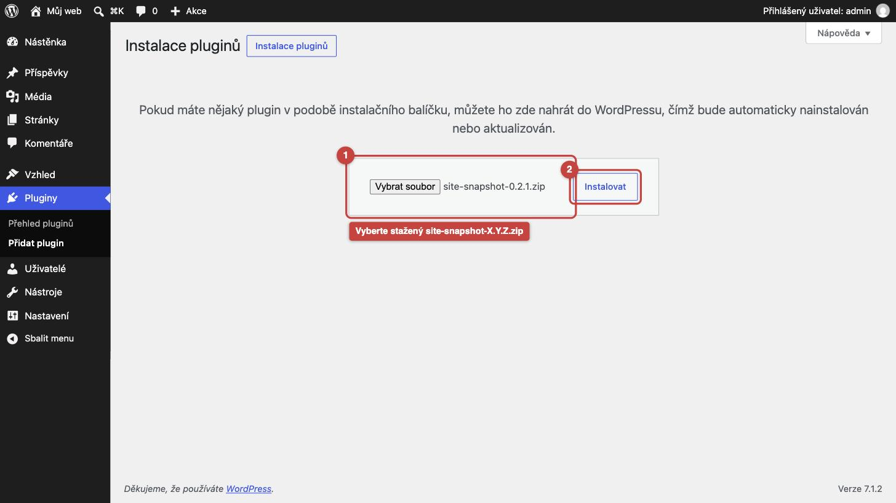

1. **Vybrat soubor** – vyberte stažený ZIP.
2. **Instalovat**.

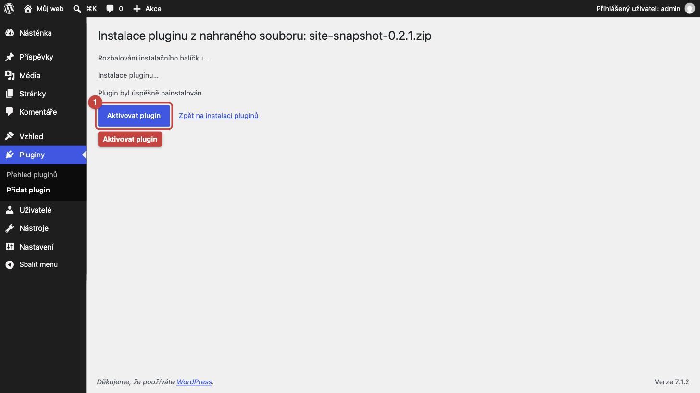

1. Po hlášce „Plugin byl úspěšně nainstalován“ klikněte **Aktivovat plugin**.

---

## 2. Kde plugin najdete

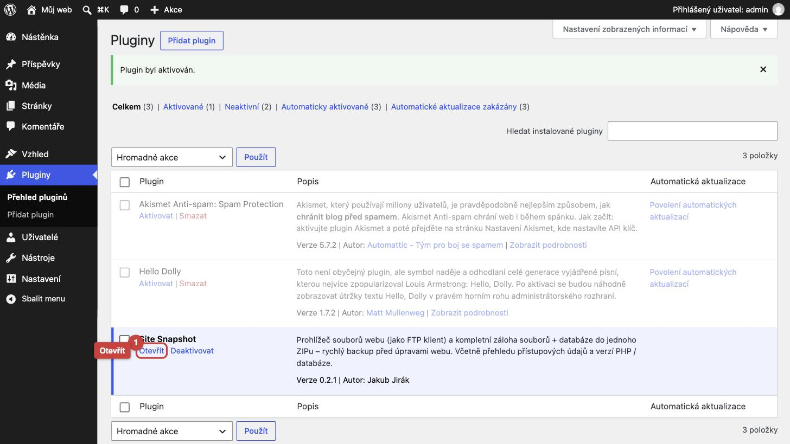

1. V seznamu pluginů je u Site Snapshot odkaz **Otevřít**…

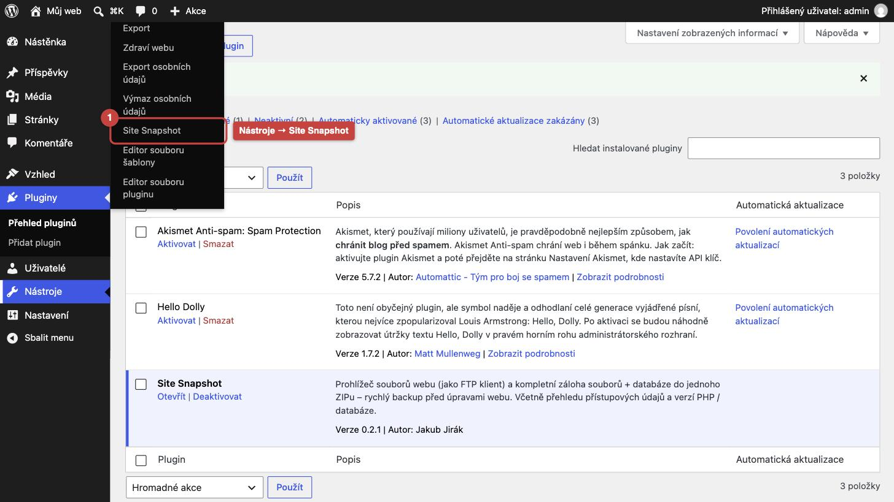

1. …nebo kdykoli přes menu **Nástroje → Site Snapshot**.

Plugin vidí jen administrátoři (na multisite super admin).

---

## 3. Vytvoření zálohy

Karta **Záloha**:

1. **Soubory webu** – celý web (WordPress, šablony, pluginy, média, `wp-config.php`). Vedle je cesta, která se zálohuje.
2. **Databáze** – všechny tabulky tohoto webu.
3. **Všechny tabulky v databázi** – zapněte jen tehdy, když databázi sdílí i jiná aplikace a chcete zálohovat i ji.
4. **Vynechat cache a zálohy jiných pluginů** – doporučeno nechat zapnuté (záloha bude menší a rychlejší).
5. **Vytvořit zálohu**.

Průběh ukazuje procenta, počet souborů a velikost. **Stránku nechte otevřenou** – při pokusu o odchod se
prohlížeč zeptá. Po dokončení se stránka sama obnoví.

1. **Zrušit zálohu** – zastaví zálohu a smaže rozpracované soubory.

---

## 4. Stažení a smazání zálohy

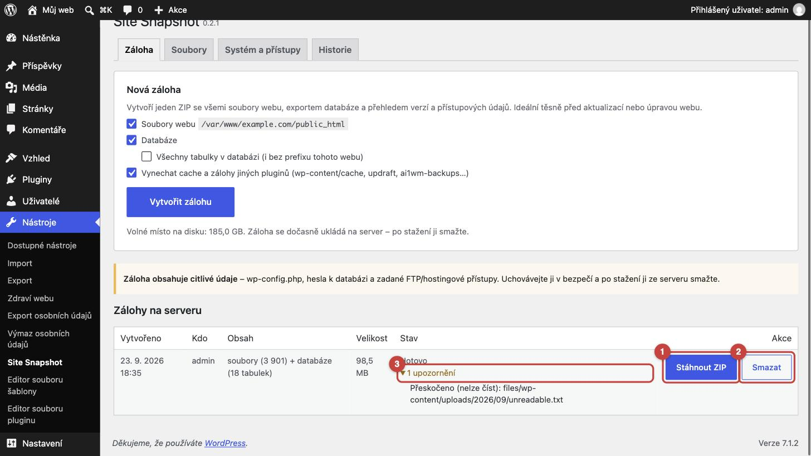

1. **Stáhnout ZIP** – stáhne celou zálohu (soubory webu, `database.sql`, `SITE-INFO.txt` s verzemi a přístupy,
   návod k obnově).
2. **Smazat** – po stažení zálohu ze serveru smažte (obsahuje hesla). Prohlížeč se ještě zeptá, jestli opravdu.
3. **Upozornění** – kliknutím rozbalíte soubory, které se nepodařilo přečíst (typicky kvůli právům). Zbytek
   zálohy je v pořádku.

---

## 5. Přerušená záloha

Když během zálohy zavřete stránku nebo vypadne připojení, nic se neztratí. Do 15 minut se záloha po otevření
karty *Záloha* rozběhne sama. Později je v seznamu jako **Přerušeno**:

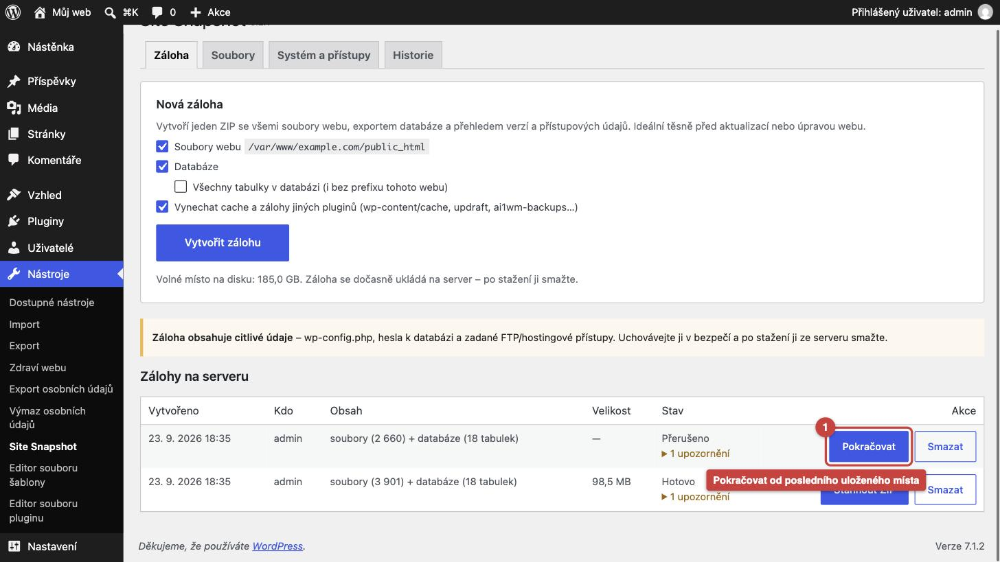

1. **Pokračovat** – záloha naváže od posledního uloženého místa.

Přerušenou zálohu, na kterou se nesáhne, smaže denní úklid – nejdřív po 24 hodinách, obvykle do 48 hodin
(na webu s malou návštěvností, kde se WP-Cron spouští jen při návštěvě, i později). Nečekejte na něj a nepotřebnou
zálohu smažte ručně.

---

## 6. Prohlížeč souborů

Karta **Soubory** funguje jako jednoduchý FTP klient (jen pro čtení a stahování):

1. Kliknutím na název otevřete složku.
2. **ZIP** – stáhne složku včetně podsložek.
3. Štítek **citlivé** – soubor obsahuje konfiguraci nebo hesla (`wp-config.php`, `.htaccess`, `.env`…).
4. **Stáhnout** – stáhne jeden soubor.
5. **Stáhnout tuto složku jako ZIP** – stáhne právě otevřenou složku.

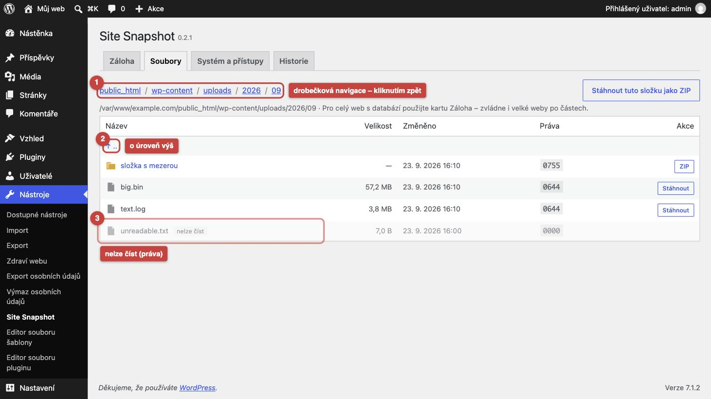

1. Drobečková navigace – kliknutím se vrátíte do nadřazené složky.
2. **↑ ..** – o úroveň výš.
3. Zašedlý soubor se štítkem **nelze číst** – PHP k němu nemá práva, nejde stáhnout ani zálohovat
   (stáhněte ho přes FTP).

> Celý web nebo velké složky stahujte raději přes kartu *Záloha* – ta zvládne i velké weby po částech.

---

## 7. Přístupové údaje

Karta **Systém a přístupy** nahoře ukazuje verze a limity WordPressu, PHP, databáze a serveru. Pod nimi jsou
přístupové údaje z `wp-config.php`:

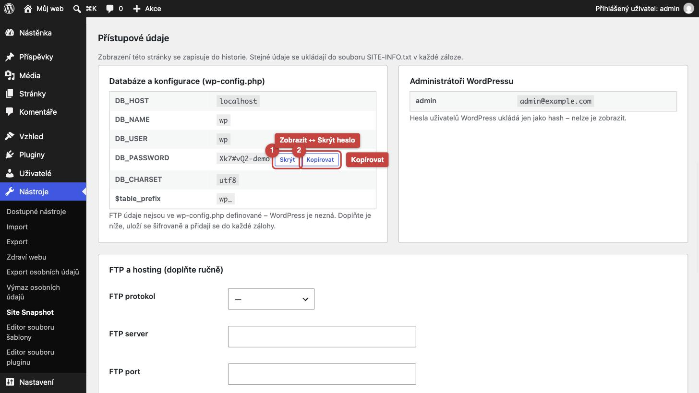

1. **Zobrazit** – odkryje heslo k databázi (na snímku už odkryté, tlačítko se změnilo na **Skrýt**).
2. **Kopírovat** – zkopíruje heslo do schránky.

FTP a hosting WordPress nezná – doplňte je ručně, ať jsou v každé záloze:

1. Vyplňte, co znáte: FTP protokol, server, port, uživatele, heslo a cestu k webu; adresu administrace hostingu,
   **přihlašovací jméno a heslo k hostingu**, odkaz na phpMyAdmin/Adminer a poznámku.
2. **Zobrazit** – ukáže zadané heslo (kontrola překlepů).

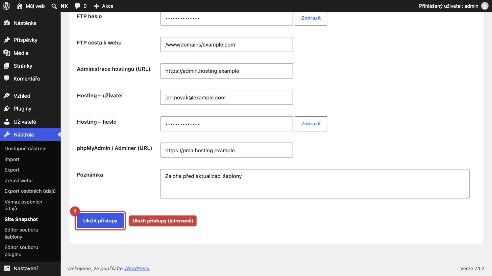

1. **Uložit přístupy** – údaje se uloží šifrovaně.

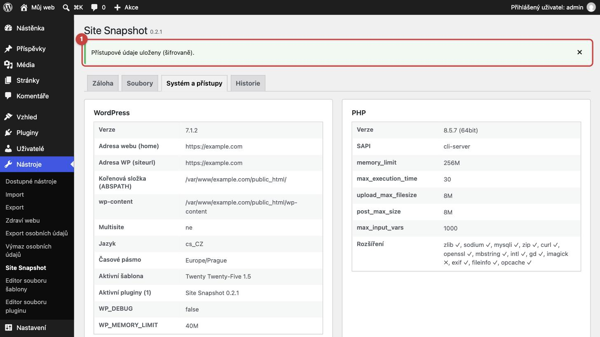

1. Potvrzení „Přístupové údaje uloženy (šifrovaně)“. Pod ním je přehled verzí a limitů.

---

## 8. Historie

1. Každý řádek: kdy, kdo, z jaké IP adresy a co udělal (záloha, stažení, zobrazení nebo uložení přístupů).
2. **Vymazat historii** – smaže záznamy; samotné vymazání se do historie zapíše.

---

## 9. Upozornění na nechráněné zálohy

Při otevření karty *Záloha* plugin sám otestuje, jestli jdou zálohy stáhnout z internetu bez přihlášení.
Pokud je vše v pořádku, **nic se nezobrazí**. Pokud ne:

1. Pravidlo pro nginx vygenerované pro váš web – vložte ho do konfigurace serveru nebo ho pošlete podpoře
   hostingu (postup v [návodu, kapitola 4](NAVOD.md#4-zabezpečení-úložiště-záloh-důležité)).
2. **Otestovat znovu** – po úpravě serveru ověří, že je ochrana funkční.

Dokud upozornění nezmizí, mažte zálohy ze serveru hned po stažení.

---

## 10. Odinstalace

**Pluginy → Přehled pluginů** → u Site Snapshot **Deaktivovat**. Deaktivace nic nemaže.

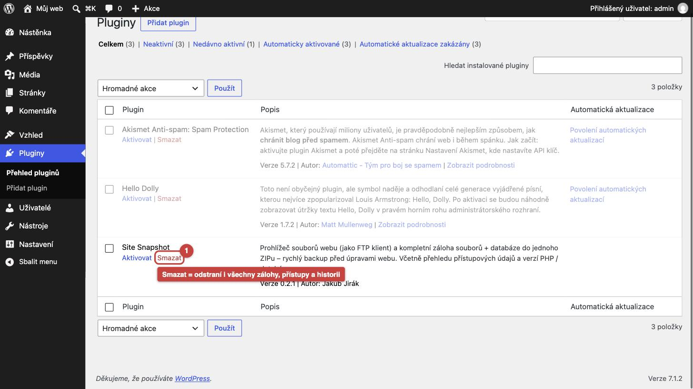

1. **Smazat** odstraní plugin **i všechny zálohy na serveru**, uložené přístupy a historii. Zálohy, které chcete
   zachovat, si předtím stáhněte.
